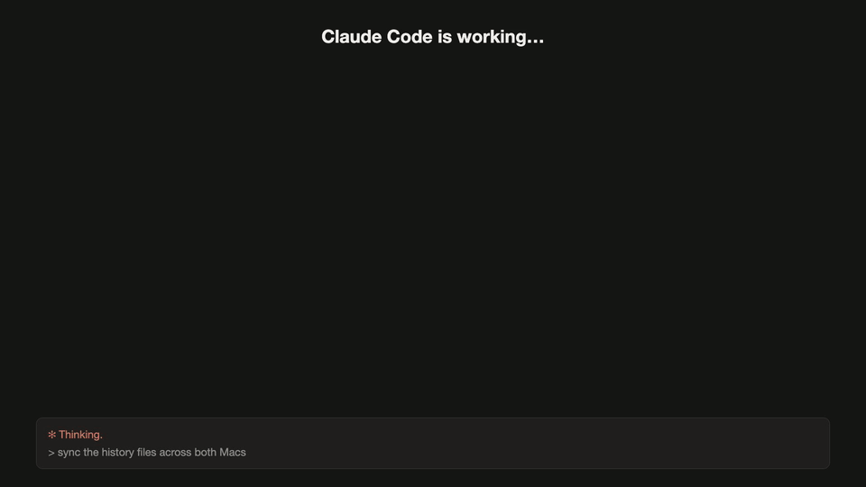

# Capi: learn a language while Claude works

A Claude Code mod. Capi the capybara shows a quiz card in the band above your
prompt, all the time or only while Claude works (`CAPI_SHOW`, see
[Configure](#configure)). Every card teaches one true real-world fact and one
expression in the language you learn (Brazilian Portuguese unless you
[configure](#configure) another), with explanations in your own language. Answer with the
digit keys (type the digit into the empty prompt) or by clicking.



Capi remembers what you know. Expressions you miss come back sooner, expressions
you know come back later, and your history syncs between your Macs through iCloud.

## Keys

| key | does |
| --- | --- |
| `1`–`4` | answer the quiz, then `sim`/`não`: did you know the expression? |
| `6` | 📐 grammar notes: contractions and the case they do the job of, word order, mood, colloquial forms |
| `7` | 🔤 every verb in the sentence, one tab per verb: present, perfect, imperfect, future, subjunctive, all persons |
| `0` | 🇩🇪 the card in your own language (the flag is yours to set) |
| `8` | 🔊 hear it (macOS voice *Luciana*) |
| `9`, then `9` again | 🚩 the fact is wrong: it is never used again, and Capi re-checks it |

Click – at the right end of the header to fold the band to that one line, and
□ to open it again. The band remembers, also in new sessions.

Click × next to it to hide Capi in this session. Only this session: a new
session shows the band again, and `/capi show` brings it back right away.

With `CAPI_PLACE=pane` the card sits in a pane beside the conversation (above the
prompt where the window is too narrow to dock one). The pane takes the keys once it
has focus: click it, or ctrl+x tab. Its own close mark hides Capi for the session,
as × does the band, and `/capi show` opens it again. A pane opened unasked waits on a
narrow window; `/capi show` opens it at any width.

`/capi` shows level, streak, points, what is due, and how the last sync and card
generation went. It answers instantly, also while Claude works. `/capi skip` drops
the current card, and `/capi show` brings back a band you closed with ×.

## Install

You need Claude Code 2.1.287 or later with mods turned on. To check, run
`claude plugin test` in an empty directory: it must not say "turned off".

Install it from [seedr](https://seedr.danieldeusing.de/plugins/capi/) or from
GitHub. Both take the plugin from this repository. To work on Capi itself, use a
clone instead.

### From seedr

```bash
npx @danieldeusing/seedr add capi --type plugin --agents claude
```

This installs Capi as a Claude Code plugin and turns it on, for every project. Add
`--scope project` to turn it on in the current project only. Start a new session:
the band appears above the prompt and the first ten cards arrive within a minute
or two.

### From GitHub

```bash
claude plugin marketplace add danieldeusing/capi-cc-mod
claude plugin install capi@capi
```

Start a new session, as above.

Both ways put the plugin in `~/.claude/plugins/cache/capi/capi/<version>/`, and
that is the folder your `.env` goes in (see [Configure](#configure)). A new version
installs into a new folder, so keep a copy of your `.env`.

### From a clone

1. Clone the repository wherever you keep code:

   ```bash
   git clone https://github.com/danieldeusing/capi-cc-mod.git ~/capi-cc-mod
   ```

2. Load it in every session, Desktop included, by adding its path to
   `~/.claude/settings.json` (keep any other keys you already have there):

   ```json
   { "env": { "CLAUDE_CODE_PLUGIN_DIRS": "/Users/you/capi-cc-mod" } }
   ```

   Several mod folders go in the same value, separated by `:`. To try it in one
   session only, start Claude Code with `claude --plugin-dir ~/capi-cc-mod`.

3. Start a new session. Capi's band appears above the prompt and the first ten
   cards arrive within a minute or two.

A session that was already open before step 2 does not see the mod.
`/reload-plugins` picks up changes to a mod that is already loaded, not a new
folder, so open a new session.

### More than one Mac

Install on each Mac the same way. Both Macs read and write the same history in
iCloud Drive, under `capi/`.

## Configure

Copy `.env.example` to `.env` in the plugin folder (the install folder above, or
your clone) and change what you like. Git
ignores `.env`. A missing file or key keeps the default shown in `.env.example`.
Capi reads the file when a session starts, so open a new session (or run
`/reload-plugins`) after a change.

| key | what it sets | default |
| --- | --- | --- |
| `CAPI_LEARN_LANGUAGE` | the language Capi teaches | `Brazilian Portuguese` |
| `CAPI_NATIVE_LANGUAGE` | your language: explanations, translations and grammar notes | `German` |
| `CAPI_NATIVE_FLAG` | the icon on the translation button | `🇩🇪` |
| `CAPI_LEARNER` | who you are, finishing the sentence "native German speaker who …"; sets the level of the cards | someone four years in Brazil, about A2/B1 |
| `CAPI_TOPICS` | what the facts on the cards are about, comma separated | Brazil, science and nature, technology, history, everyday life, food, health and fitness |
| `CAPI_PERSONS` | the rows of the conjugation table, separated by `\|` | `eu\|você\|ele/ela\|nós\|vocês` |
| `CAPI_TENSES` | its columns, separated by `\|` | `presente\|pretérito perfeito\|pretérito imperfeito\|futuro\|subjuntivo presente` |
| `CAPI_SHOW` | when the band is there: `always`, or `working` for only while Claude works | `always` |
| `CAPI_PLACE` | where the card is drawn: `band` above the prompt, or `pane`, a panel beside the conversation like the terminal and browser in Claude Code Desktop | `band` |
| `CAPI_PANE_OPEN` | with `CAPI_PLACE=pane`: `auto` opens the pane by itself when a session starts (with `CAPI_SHOW=working`, when a turn starts), `manual` only with `/capi show` | `auto` |
| `CAPI_NEW_PER_DAY` | new expressions a day at most; after that only reviews and bonus cards, and `0` means reviews only | `25` |

An English speaker learning Portuguese, with cards about football and music:

```bash
CAPI_NATIVE_LANGUAGE=English
CAPI_NATIVE_FLAG=🇬🇧
CAPI_LEARNER=has just moved to São Paulo and knows a few hundred words
CAPI_TOPICS=football, Brazilian music, food, travel in Brazil
```

The language settings only change what the model writes. The band's own words
(categoria, pergunta, nível, Kanntest du …?) stay Portuguese and German whatever
the settings say. The persons and tenses only make sense for a language that has
them. The rest is untested beyond Portuguese.

## How it learns

- **The learning unit is the expression**, not the sentence. When an expression is
  due again, Capi writes a new fact around it.
- **Leitner boxes**: due again after 1, 3, 7, 30 and 90 days. A miss comes back
  after 20 minutes in the other language format (the payback round).
- **Placement**: during the first week, an expression you already know jumps
  straight to box 4.
- **At most 25 new expressions a day** (`CAPI_NEW_PER_DAY`), across all sessions
  and both Macs. After that, only reviews and bonus cards.

## Models and cost

Every model call uses `claude-opus-5-5` on your own Claude plan, so cards count
against your usage like any other request:

| call | effort | when |
| --- | --- | --- |
| ten new cards | `high` | when fewer than 4 cards are queued; cards leave the queue only when answered |
| 🚩 re-check | `xhigh` | once per flag |
| 🇩🇪 for an older card | `low` | once per card, when 🇩🇪 is first pressed on a card made without translations |
| 📐 grammar notes | `medium` | once per card, when 📐 is first pressed |
| 🔤 conjugations | `low` | once per card, when 🔤 is first pressed |

A visible band costs nothing by itself: only answering pulls new cards. Change the
models at the top of `hooks/register.js` (`GENERATE`, `CHECK`, and the `call` of
each panel).

## Data

- `$.store` (`~/.claude/plugins/store/`): the shared card queue, whether the band
  is folded, and the answers not yet folded into the history file
- `~/Library/Mobile Documents/com~apple~CloudDocs/capi/<Mac>-<YYYY-MM>.jsonl`: each
  Mac's history, one file per month. Every Mac reads every file and writes only its
  own, through a temporary file and a rename, and never with fewer entries than
  it wrote before. Without iCloud Drive, Capi still works and keeps history on
  that Mac only.

## Develop

```bash
node --test test/*.test.mjs       # the learning logic, no Claude Code needed
claude plugin test                # the wiring, in Claude Code's own test kit
claude plugin validate . --strict # what Claude Code reads from the mod
```

`video/` is the Remotion source of the tour above: `npm install`, then
`npm run render && npm run gif` in that folder.

See [CONTRIBUTING.md](CONTRIBUTING.md) before opening a pull request.

Tested with Claude Code 2.1.287.

## License

[MIT](LICENSE)
